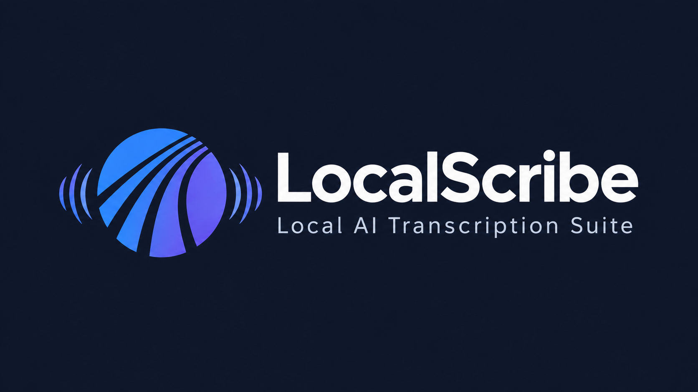
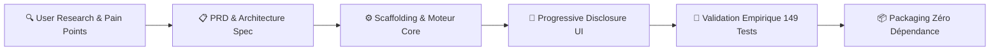

<div align="center">

  

  <br/><br/>

  # 🎙️ LocalScribe
  ### Studio Desktop IA de Transcription, Diarisation & Traduction — 100% Locale, Privée & Zéro-Terminal

  [](https://github.com/LyesHarrar/LocalScribe)
  [](https://github.com/LyesHarrar/LocalScribe)
  [](https://github.com/LyesHarrar/LocalScribe)
  [](https://github.com/LyesHarrar/LocalScribe)
  [](LICENSE)

  <br/>

  <p align="center">
    <b>LocalScribe</b> transforme vos enregistrements audio et vidéo en textes structurés, sous-titres horodatés et traductions multilingues, <b>directement sur votre machine</b>, sans aucun appel réseau, sans abonnement SaaS et sans aucune ligne de commande pour l'utilisateur final.
  </p>

  <p align="center">
    <a href="#-pourquoi-localscribe--vision-produit">Pourquoi LocalScribe ?</a> •
    <a href="#-galerie--aper%C3%A7u-du-produit">Aperçu Visuel</a> •
    <a href="#-fonctionnalit%C3%A9s-cl%C3%A9s">Fonctionnalités</a> •
    <a href="#-d%C3%A9marche-product-builder--ux-craft">Démarche Product</a> •
    <a href="#%EF%B8%8F-architecture-technique--stack">Architecture & Stack</a> •
    <a href="#-d%C3%A9marrage-rapide">Démarrage Rapide</a>
  </p>

</div>

---

## 🎯 Pourquoi LocalScribe ? (Vision Produit)

### Le Problème du Marché
Aujourd'hui, transcrire des réunions, des entretiens ou des formations confronte les utilisateurs et les entreprises à un dilemme critique :

1. **Les solutions SaaS grand public (Otter, Descript, Whisper API Cloud) :**
   - ❌ **Fuites de confidentialité & RGPD :** Fichiers sensibles (médicaux, juridiques, stratégiques, RH) téléversés sur des serveurs tiers.
   - ❌ **Modèle économique à friction :** Abonnements mensuels coûteux, quotas de minutes stricts, coûts exponentiels à grande échelle.
   - ❌ **Dépendance réseau :** Impossibilité de travailler dans le train, en avion ou en environnement sécurisé (air-gapped).

2. **Les bibliothèques Open-Source brutes (Whisper, CTranslate2, PyAnnote) :**
   - ❌ **Barrière technique infranchissable :** Lignes de commande, environnements Python complexes, dépendances CUDA, erreurs de DLL, tokens HuggingFace payants ou complexes.
   - ❌ **Zéro expérience utilisateur :** Pas d'éditeur interactif, pas d'estimation de temps, pas de gestion d'erreur visuelle.

### La Réponse Produit : LocalScribe
**LocalScribe comble le fossé entre la puissance des modèles IA de pointe et l'accessibilité grand public.**  
C'est un produit de bureau souverain, autonome et packagé "Zéro Terminal", qui offre l'ergonomie d'un SaaS moderne alliée à la confidentialité absolue d'un traitement 100 % local sur puce.

---

## ✨ Fonctionnalités Clés

### 🧠 Moteur d'Inférence IA Haute Performance
- **Whisper optimisé (faster-whisper / CTranslate2) :** Vitesse de transcription 4x supérieure à l'implémentation standard OpenAI, avec division par 2 de la mémoire VRAM requise.
- **Accélération Matérielle Hybride :**
  - **GPU NVIDIA :** Détection et résolution automatique des DLLs CUDA 12 / cuDNN 9 (FP16).
  - **CPU Multi-Cœurs :** Quantification vectorielle `int8` ultra-rapide pour les machines sans carte graphique dédiée.
- **Décodage Dual-Mode :** Mode **Éclair (Beam Size 1)** pour une vitesse fulgurante (jusqu'à 15x temps réel) ou mode **Précis (Beam Size 5)** pour les enregistrements complexes ou techniques.

### 👥 Diarisation des Locuteurs 100% Hors-Ligne (Speaker Diarization)
- **Identification de "qui parle quand" :** Intégration du moteur `sherpa-onnx` combinant la segmentation ONNX PyAnnote et les embeddings acoustiques CAM++.
- **Zero-Token & Zero-Network :** Ne nécessite **aucun compte HuggingFace**, aucun token API payant, et aucune connexion Internet.
- **Renommage Interactif :** Remplacement dynamique des étiquettes (`Locuteur 1` → `Dr. Martin`) propagé instantanément sur l'ensemble de la transcription.

### 🌐 Traduction Neuronale Hors-Ligne (Meta NLLB-200)
- **24 langues supportées :** Moteur neuronal `Meta NLLB-200` quantifié en INT8 exécuté en local sans aucun serveur distant.
- **Préservation de structure :** Conservation stricte des balises locuteurs et des horodatages pour les sous-titres `.srt`.
- **Traduction à la demande :** Déclenchable en direct ou rétroactivement sur n'importe quel fichier de l'historique.

### 🎛️ Studio de Prétraitement Audio (FFmpeg Pipeline)
- **Extraction automatique :** Séparation ultra-rapide des flux audio depuis les conteneurs vidéo (`.mp4`, `.mkv`, `.avi`, `.mov`, `.webm`).
- **Auto-Gain Dynamique (`dynaudnorm`) :** Égalisation intelligente amplifiant les chuchotements et voix lointaines sans saturer les passages forts.
- **Filtrage Spectral & Débruitage :** Suppression des bruits de fond continus (climatisation, souffle micro, parasites).

### ✏️ Éditeur Karaoké Interactif & Post-Production
- **Lecteur Audio-Texte synchronisé :** Suivi karaoké en temps réel avec défilement automatique et surbrillance du segment actif.
- **Navigation au clic :** Saut immédiat à la seconde exacte de l'audio en cliquant sur n'importe quel mot.
- **Recherche & Remplacement global :** Correction orthographique en lot de termes techniques ou patronymes.
- **Fusion et découpage :** Ajustement manuel des segments temporels avec sauvegarde atomique en base.

### 📦 Traitement par Lot & Mode Dossier
- **Dropzone Multi-fichiers :** Glisser-déposer de 1 à 100+ fichiers traités séquentiellement à la chaîne avec chargement unique du modèle en mémoire.
- **Mode Dossier In-Place :** Scan récursif d'une arborescence complète avec reprise automatique (*Smart Resume*) pour ignorer les vidéos déjà traitées.
- **Estimation de temps (ETA) en direct :** Calcul dynamique du facteur de vitesse (ex: `8.5x temps réel`) et du temps restant estimé.

### 🗄️ Historique Persistant SQLite & Exports 1-Clic
- **Base de données locale :** Historisation automatique de chaque transcription avec métriques de confiance et horodatages.
- **Moteur de recherche plein texte :** Retrouvez n'importe quelle intervention prononcée dans des centaines d'heures d'enregistrements.
- **Exports multi-formats :** `.txt` brut, `.srt` sous-titres, `.md` Markdown structuré, et archive `.zip` globale en un clic.

---

## 🧠 Démarche Product Builder & UX Craft

En tant que **Product Manager & Builder**, ce projet a été conduit selon les meilleures méthodologies de delivery produit :



### 1. Progressive Disclosure (Conception pour les 80 / 20)
* **Pour 80% des utilisateurs (Non-techniciens) :** Présentation de **3 profils macro 1-clic** simplifiés :
  - **⚡ Profil Éclair :** Vitesse maximale (Beam 1, int8, VAD activé). Idéal cours, réunions et podcasts.
  - **⚖️ Profil Équilibré :** Le compromis idéal rapidité / précision pour les formats standards.
  - **🎯 Profil Studio :** Précision maximale (Beam 5, normalisation Auto-Gain, diarisation).
* **Pour 20% des utilisateurs (Power Users) :** Accordéon rétractable permettant de débrayer chaque paramètre fin (taille de faisceau, seuil VAD, prompts personnalisés, modèles de `tiny` à `large-v3`).

### 2. Jauge d'Impact Dynamique (Predictive User Feedback)
Au lieu de forcer l'utilisateur à deviner les conséquences de ses réglages, LocalScribe intègre un calculateur d'impact en temps réel (`core/impact_estimator.py`) qui met à jour visuellement deux jauges animées :
- **Indicateur de Vitesse relative :** Évaluation chiffrée de la rapidité (ex: `11x - 15x temps réel`).
- **Indicateur de Précision :** Évaluation du niveau de fidélité contextuelle.

### 3. Philosophie "Zéro-Terminal" & Zéro Friction
- **Aucune invite de commande :** Tous les sous-processus d'arrière-plan (FFmpeg, PowerShell pour les notifications toast, nvidia-smi) sont encapsulés sous Windows avec les structures Win32 `STARTUPINFO` et `SW_HIDE`. Aucune fenêtre noire ne clignote jamais à l'écran.
- **Zéro latence au clic :** Mise en cache LRU (`@lru_cache`) et persistance `st.session_state` éliminant 100 % des gels d'interface lors de la navigation.

---

## 🏗️ Architecture Technique & Stack

LocalScribe repose sur une architecture découplée, modulaire et hautement résiliente :

```
LocalScribe/
├── assets/                  # Identité visuelle, logos, icônes, bannières
├── bin/                     # Binaires FFmpeg autonomes embarqués pour Windows
├── core/                    # Moteur métier pur (indépendant de l'UI)
│   ├── engine.py            # Orchestrateur Whisper & CTranslate2
│   ├── diarizer.py          # Pipeline de diarisation sherpa-onnx (PyAnnote/CAM++)
│   ├── translator.py        # Moteur de traduction locale Meta NLLB-200
│   ├── audio_preprocessor.py# Pipeline FFmpeg (Auto-Gain, Denoise, extraction)
│   ├── hardware_profiler.py # Détection VRAM, CUDA et configuration cuBLAS
│   ├── history_db.py        # Base SQLite locale & recherche FTS
│   ├── impact_estimator.py  # Jauge prédictive temps réel vitesse/précision
│   ├── notifications.py     # Toasts natifs Windows 10/11 sans console
│   └── version.py           # Métadonnées et vérificateur de releases GitHub
├── desktop/                 # Couche application de bureau native
│   ├── launcher.py          # Bootstrap natif CPython & détection WebView2
│   ├── run_app.py           # Serveur Streamlit encapsulé dans pywebview
│   └── package_portable.py  # Pipeline de packaging distribution autonome
├── ui/                      # Interface utilisateur réactive
│   └── app.py               # Vues Streamlit, composants CSS Shadcn & éditeur
├── tests/                   # Suite de tests unitaires et d'intégration (149 tests)
└── docs/                    # PRD et Spécifications Techniques détaillées
```

### Matrice Technologique

| Couche | Technologie | Rôle & Justification Technique |
| :--- | :--- | :--- |
| **Interface Desktop** | Streamlit + `pywebview` | Rendu moderne web avec composants réactifs encapsulé dans une vraie fenêtre Windows native sans la lourdeur d'Electron (~150 MB de RAM en moins). |
| **Inférence Vocale** | `faster-whisper` (CTranslate2) | Moteur C++ hautement optimisé, exécution FP16 sur GPU NVIDIA et INT8 sur CPU. |
| **Diarisation** | `sherpa-onnx` | Inférence ONNX Runtime locale, aucun appel réseau, aucune dépendance payante. |
| **Traduction** | `Meta NLLB-200` | Modèle de traduction neuronale 200 langues quantifié pour exécution locale rapide. |
| **Traitement Signal** | `FFmpeg` (statique) | Filtres `dynaudnorm` et `afftdn`, conversion de formats multi-flux sans perte. |
| **Données & FTS** | `SQLite3` (WAL mode) | Persistance ACID, requêtes plein texte instantanées, transactions sécurisées. |
| **Résilience & Threads** | Python `threading` & `queue.Queue` | Découplage strict entre le moteur d'inférence lourd et l'interface pour garantir 60 FPS constants. |

---

## 🔬 Méthodologie & Rigueur d'Ingénierie

Le projet a été développé selon les principes stricts définis dans le document vivant [`AGENTS.md`](AGENTS.md) :

1. **La Réalité Prime sur la Théorie (Empirical Verification) :**
   Aucune fonctionnalité n'est considérée comme achevée sans validation par des tests unitaires automatisés.
2. **Couverture de Tests Maximale :**
   **149 tests unitaires et d'intégration** couvrent l'intégralité du cycle de vie :
   ```bash
   python -m unittest discover -s tests -p "test_*.py"
   # Ran 149 tests — OK
   ```
3. **Écritures Disque Atomiques :**
   Toute génération de transcription utilise le pattern d'écriture temporaire `.tmp` suivi d'un renommage atomique, garantissant qu'aucun fichier ne soit corrompu en cas de fermeture inopinée.

---

## 🚀 Démarrage Rapide

### Option A : Version Portable Autonome (Recommandée — Tout Public)
*Aucune installation de Python requise.*
1. Rendez-vous dans la section **[Releases](https://github.com/LyesHarrar/LocalScribe/releases)**.
2. Téléchargez l'archive `LocalScribe-Portable-v2.4.2.zip`.
3. Dézippez le dossier et double-cliquez sur **`LocalScribe.exe`**.

### Option B : Environnement Développeur

**Prérequis :** Python 3.10 ou supérieur, [FFmpeg](https://ffmpeg.org/) (optionnel mais recommandé).

```bash
# 1. Cloner le dépôt
git clone https://github.com/LyesHarrar/LocalScribe.git
cd LocalScribe

# 2. Créer et activer l'environnement virtuel
python -m venv .venv
.venv\Scripts\activate      # Sur Windows
# source .venv/bin/activate # Sur macOS/Linux

# 3. Installer les dépendances
pip install -r requirements.txt

# 4. Lancer la suite de tests
python -m unittest discover -s tests -p "test_*.py"

# 5. Démarrer l'application Desktop
python desktop/run_app.py
```

---

## ⚖️ Confidentialité & Mentions Légales

- **100 % Respectueux de la Vie Privée :** LocalScribe ne collecte **aucune télémétrie**, n'envoie aucune donnée à des serveurs distants et ne nécessite aucune connexion Internet après récupération des modèles.
- **Licence :** Ce projet est distribué sous licence open-source **MIT**. Voir le fichier [LICENSE](LICENSE) pour plus de détails.
- **Composants Tiers :** Les licences des bibliothèques et modèles intégrés (Whisper, CTranslate2, FFmpeg, sherpa-onnx, NLLB-200) sont documentées dans [LICENSES-THIRD-PARTY.txt](LICENSES-THIRD-PARTY.txt).

