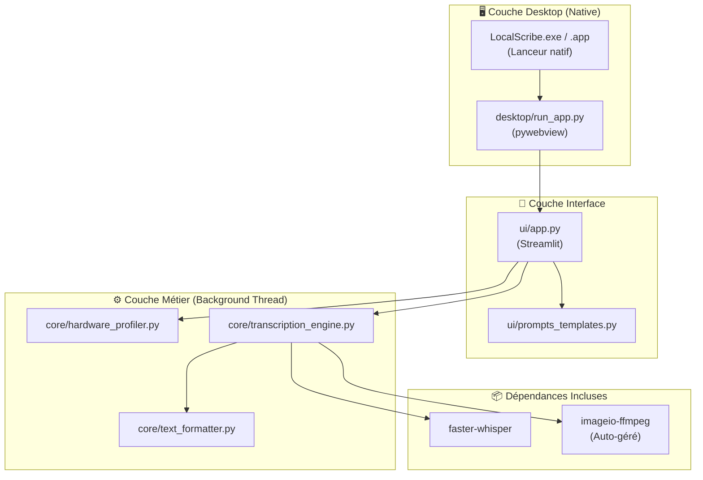

# 🛠️ Spécification Technique — LocalScribe

**Version :** 1.1 — MVP (Mise à jour UX & Cross-Platform)  
**Auteur :** Lyes Harrar  
**Statut :** Approuvé  
**Référence :** [PRD_LocalScribe.md](file:///C:/Users/lyesh/Documents/Projets%20IA/LocalScribe/docs/PRD_LocalScribe.md)

---

## 1. Vue d'ensemble de l'Architecture

LocalScribe est une application de bureau **100 % locale** qui encapsule un moteur de transcription dans une interface graphique moderne. Pensée pour le grand public, l'expérience est "Zéro Terminal" : aucun script à lancer manuellement, aucune console visible.



---

## 2. Stack Technique & Stratégie UX

| Composant | Technologie | Justification & Impact UX |
|---|---|---|
| **Moteur ASR** | `faster-whisper` | 4× plus rapide. Support int8/float16. |
| **Audio** | `imageio-ffmpeg` | Package Python gérant les binaires FFmpeg de manière invisible multi-OS. |
| **UI** | Streamlit + shadcn | Prototypage rapide, widgets natifs, UI SaaS moderne. |
| **Fenêtre native** | pywebview | Fenêtre Windows/Mac. Vérification de WebView2 intégrée. |
| **Exécutable** | PyInstaller (Lanceur) | Génère un `.exe` / `.app` léger cachant l'appel à Python. Zéro `.bat` pour l'utilisateur. |
| **Multithreading** | `threading` Python | L'interface Streamlit reste fluide pendant la transcription. |
| **Environnement** | Python Portable pré-packagé | Le dossier distribué contient DÉJÀ toutes les dépendances pip. |

---

## 3. Spécification des Modules — Couche Core

### 3.1 `core/hardware_profiler.py`

**Responsabilité :** Détecter le matériel au lancement (sans crasher) et recommander un profil.

```python
@dataclass
class HardwareProfile:
    device: str              # "cuda" | "mps" | "cpu"
    compute_type: str        # "float16" | "int8"
    recommended_model: str   # "large-v3" | "medium" | "small"
    vram_gb: float | None    
    warnings: list[str]

def detect_hardware() -> HardwareProfile:
    """Détecte CUDA (Torch), MPS (Apple), ou CPU. Gère les exceptions silencieusement."""
    ...
```

### 3.2 `core/transcription_engine.py`

**Responsabilité :** Orchestrer la transcription avec écriture atomique (Smart Resume) et gestion de threads.

```python
def transcribe_batch_threaded(
    target: Path,
    profile: HardwareProfile,
    progress_queue: queue.Queue,
    stop_event: threading.Event
) -> None:
    """S'exécute dans un Thread séparé pour ne pas bloquer Streamlit."""
    ...
```

**Écriture Atomique (Smart Resume) :**
1. Lancer transcription → écrire résultat dans `fichier.md.tmp`.
2. En cas de coupure (Stop), le `.tmp` partiel reste.
3. En cas de succès (100 %) → `os.rename(tmp, final)`.
4. Au lancement suivant, ignorer les `final` existants.

### 3.3 `core/text_formatter.py`

Gère l'export en YAML Front-matter, SRT, INDEX global et le routage vers un dossier miroir isolé.

---

## 4. Spécification — Couche UI (`ui/app.py`)

L'UI est au cœur de l'UX "Non-technique".

**Le Premier Lancement (UX Téléchargement) :**
- L'application est livrée sans le modèle lourd Whisper pour réduire la taille du ZIP.
- Au premier lancement, l'UI Streamlit affiche une belle carte : *"Initialisation du moteur d'IA..."* avec une barre de progression de téléchargement (via `huggingface_hub`). L'utilisateur reste dans l'application.

**Gestion du Threading (UI Réactive) :**
```python
# Dans app.py
if st.button("Lancer la transcription"):
    # 1. Préparer une queue de messages
    st.session_state.progress_queue = queue.Queue()
    st.session_state.stop_event = threading.Event()
    
    # 2. Lancer le thread
    t = threading.Thread(
        target=transcribe_batch_threaded, 
        args=(..., st.session_state.progress_queue, st.session_state.stop_event)
    )
    add_script_run_ctx(t) # Streamlit thread context
    t.start()
    st.session_state.is_processing = True

# 3. Boucle de rafraîchissement UI
if st.session_state.get("is_processing"):
    while not st.session_state.progress_queue.empty():
        msg = st.session_state.progress_queue.get()
        # Mettre à jour les widgets (Barre de progression, status...)
    time.sleep(0.5)
    st.rerun()
```

---

## 5. Spécification — Couche Desktop (`desktop/run_app.py`)

Gère la fenêtre native et les dépendances système.

```python
def check_webview_dependencies():
    """Vérifie si WebView2 est installé sur Windows."""
    if sys.platform == "win32":
        try:
            import webview
            # Test interne rapide
        except Exception:
            # Fallback natif (tkinter) pour avertir l'utilisateur proprement
            import tkinter as tk
            from tkinter import messagebox
            root = tk.Tk(); root.withdraw()
            messagebox.showerror(
                "Composant manquant", 
                "LocalScribe nécessite 'Microsoft Edge WebView2'.\nWindows va le télécharger."
            )
            webbrowser.open("https://developer.microsoft.com/en-us/microsoft-edge/webview2/")
            sys.exit(1)
```

---

## 6. Packaging & Distribution (Zéro `.bat`)

### Stratégie "Prêt-à-l'emploi"
1. **L'archive ZIP distribuée contient :**
   - Le code source (`core`, `ui`, `desktop`).
   - Le sous-dossier `python/` (Python Portable).
   - **Toutes les librairies** (`streamlit`, `faster-whisper`, `torch`) pré-installées dans le `site-packages` du python portable.
2. **Le Lanceur :** Un petit exécutable (`LocalScribe.exe` sur Windows) généré via PyInstaller ou un script compilé en C qui fait une seule chose : lancer le `run_app.py` via le python portable de manière invisible.

---

## 7. Plan d'Implémentation par Étapes (MVP)

| Phase | Tâches | Cible |
|---|---|---|
| **0. Scaffolding** | Création arborescence, UI de base, config Streamlit. | Lancement de l'UI vide via Python. |
| **1. Moteur & Threading** | Profiler CUDA/MPS, Whisper, logique Smart Resume. | Transcription fonctionnelle via un thread de fond sans geler l'UI. |
| **2. UI & UX** | Téléchargement du modèle in-app, exports (.srt, .md), templates LLM. | Interface complète, barre de progression fonctionnelle. |
| **3. Desktop & Lanceur** | `run_app.py`, gestion erreurs WebView2, génération `LocalScribe.exe`. | App native fonctionnelle par double-clic. |

---

## 8. Matrice de Tests d'Acceptation (Focus UX)

| ID | Scénario | Résultat attendu UX |
|---|---|---|
| T-01 | Premier double-clic sur `.exe` vierge | L'UI s'ouvre, lance le téléchargement in-app du modèle avec barre de progression. |
| T-02 | Fichier lourd (2h+) | L'UI reste 100% cliquable (onglets réactifs) pendant le traitement. |
| T-03 | Windows vierge (sans WebView2) | Popup d'erreur élégant (pas de crash silencieux) + lien de téléchargement. |
| T-04 | Fermeture sauvage (X) pendant transcription | Le thread s'arrête proprement. Au relancement, le `.tmp` est effacé et le fichier reprend. |
| T-05 | Lancement sur Mac | Le code détecte MPS (Apple Silicon) et utilise l'accélération native. |
